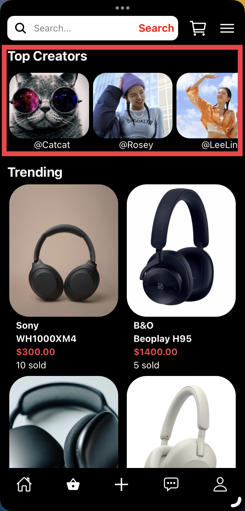
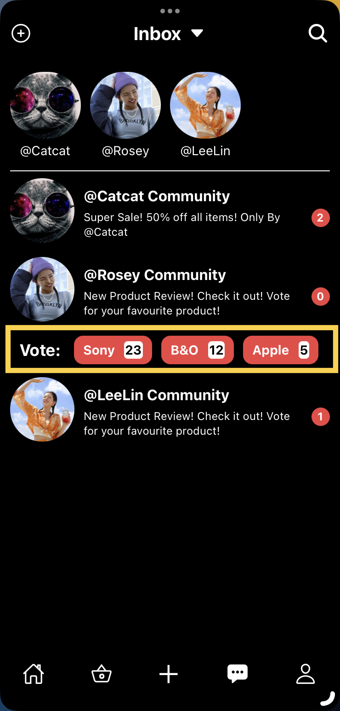

# TikTok Hackathon - 2023
- By Team: DouYin
- App will feature User Interface with features that enhances the user experience of TikTok
- App will feature a backend server that will be used to store user data and provide API for the frontend to use, however for simplicity, I have created mock data for the frontend to use.

## Short abstract of the project
* In response to the ever-evolving challenges within the dynamic realm of contemporary e-commerce, our innovative team has crafted a collection of agile, robust, and trendsetting features, artfully executed with a comprehensive JavaScript approach. Our objective is to elevate TikTok's prominence, resonating with both its extensive user base and the influential Gen-Z fashion mavens.
* Our premier solution centers around replacing the conventional, somewhat inconspicuous product links with a dynamic pop-up window that elegantly graces the right side of the screen. This captivating window not only serves as a visual runway for showcasing handpicked, chic products but also flaunts an exclusive discount code meticulously chosen by the style-conscious content creators for their fashion-savvy followers. Simultaneously, the original product link location metamorphoses into a ranking feature, not only stimulating the content creator's sartorial creativity but also spotlighting their authority within the fashion-forward community.
* Furthermore, within this fashion-forward pop-up window, an enticing "Shop Now" link effortlessly guides users to a meticulously curated shopping cart, preloaded with the featured couture piece, complete with the creator's exclusive discount code applied effortlessly.
* Venturing into the Inbox screen, we seamlessly unite the act of shopping with the art of messaging. Here, we introduce an engaging voting feature that transforms commercial transactions into fashion dialogues, fostering a runway of communication within the fashion-forward community, enabling content creators to accessorize their style while engaging with their devoted followers.
* Additionally, our platform passionately encourages fashion-forward content creators to embrace entrepreneurial endeavors by incorporating a "Top Creators" module in the Shop screen, spotlighting the most influential fashion icons of the TikTok fashion cosmos.
* Our project boldly epitomizes the vanguard of technology within the fashion industry, elevating user engagement, amplifying sales, and cultivating a vibrant social shopping ecosystem. "xx" epitomizes the future of e-commerce, where fashion-forward social interactions ignite commerce, and shopping is transformed into a collaborative and immersive fashion experience.

### Product demo URL or video

### Chosen Problem statement
* E-commerce (Social commerce)

### APIs used in the project
* All APIs are internal APIs

### Development tools used to build the project
* React Native
* Expo
* Node.js
* MongoDB
* Express.js

### Assets used in the project
* Images are from urls online
* Icons are from expo icons

### Libraries used in the project
* React Native
* Expo
* Node.js
* MongoDB
* Express.js

### Any components not created at the hackathon
- None

## Features
- [x] Video Feed will have a small tab located at the side of the screen that will allow users to view products offered by the creator with informative detail of the product
- [x] Video Feed will have the option for the users to join the content creator's community and view the content creator's rankings
- [x] Simple changes to the shopping screen which eill allow content creators to be spotlighted
- [x] Content creators will be able to organise votes for the products their fans want to see to be review or featured in their videos
- [x] Content creators will be able to organise polls for their fans to vote on what they want to see in their videos

## To Start the App Locally:
### Frontend
1. cd to frontend and run `yarn install`
2. Run `npx expo start` to start expo
3. Download Expo go on your mobile phone and scan the qr-code
4. Play with the App

### Backend
NOTE: Backend is not required to run the app locally. It is only required if you want to test the backend API.
1. cd to backend and run `yarn install`
2. Run `yarn start` to start the backend server

